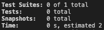

# LAP 3 Group Project
## Who's that Pokemon? - a React based, Quiz app
#### Sean, Kornelia, Ami, Oli, && Peter

We were tasked with creating a multiplayer online quiz game, using React. We decided to do a "Who's that Pokemon?" quiz, as Pokemon have been a recurring theme for most of our classes, and because they're neat.

## Project Brief
#### Our website should have the following functionality for users:
- Users should be able start a game with a limited number of players _(this can be from one computer or we may wish to consider use of websockets eg. [SocketIO](https://github.com/getfutureproof/fp_guides_wiki/wiki/Intro-to-Socket.IO)_
- Users should be able to choose the level and topic for their quiz game.
- Users should take it in turns to answer trivia questions and after a set number of turns a winner should be declared.
- Users scores should be stored in a database at the end of the game.
- Users should be able to view a high scores list.

#### Our project should meet the following technical requirements:
- Client to be written using React (Redux is optional).
- A small API connected to a database of scores.
- Make use of an open API such as [Open Trivia DB](https://opentdb.com/api_config.php).
- Minimum 60% test coverage with an aim of 80%.

## Game Instructions
* Open browser
* Guess Pokemon

## Development Instructions
Install packages with `npm install`

Once installed, run the following commands with `npm run`. For example, to run the development script, use `npm run dev`.

* `cypress` - Runs Cypress front end testing
* `dev` - Run development
* `build` - Run production build
* `test` - Run all tests
### Cypress Testing
* `cy:open` - Opens Cypress to manually assess tests
* `cy:run` - Runs Cypress end to end (e2e) tests. Main method for testing.
* `cy:c` - Runs Cypress Component testing and returns results to the console.
* `pikachu` - Attempt to run coverage tests.

## Technologies Used
* Computers
* React
* Pokeballs

## Testing
* Coverage:

## Wins & Challenges

### Wins
* Pokeballs

### Challenges
* Hammer Guy
* Socket.io

## Links
* [Who's That Pokemon?](https://kakuna-matata.netlify.app) - The App hosted on netlify
* [Heroku Server](https://kakunamatata.herokuapp.com) - The App hosted on Heroku
* [LAP 3 Portfolio Week Project](https://gist.github.com/getfutureproof-admin/521aa21341468693326842e63db80fe2) - The project brief
* [Client](https://github.com/oscr1998/Kakuna_Matata_Clientside) - Front End Repo
* [Server](https://github.com/oscr1998/Kakuna_Matata_Serverside) - Back End Repo
